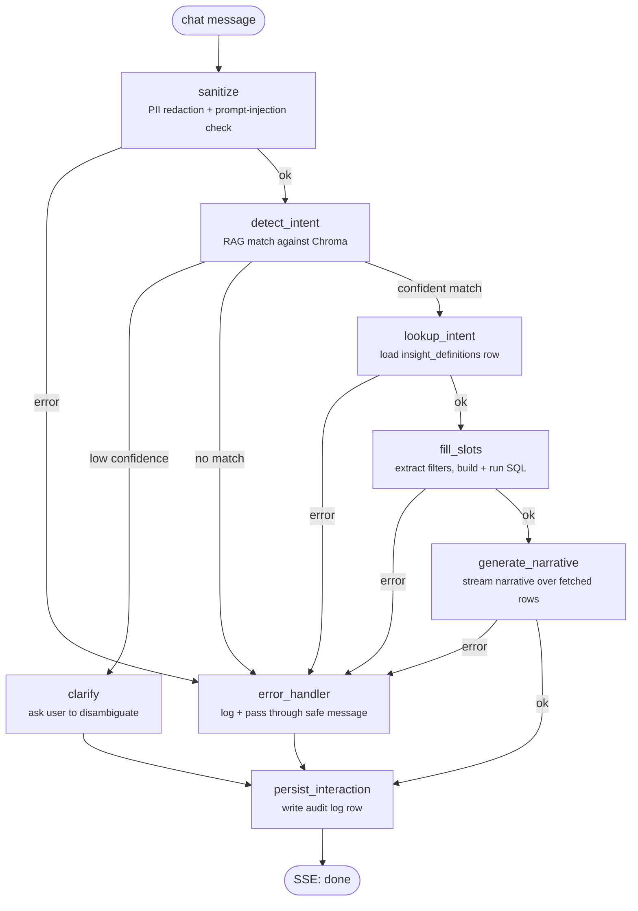

# Insight Agent

A natural-language insight agent. A user asks a question like *"clients with
account balance greater than 1 million from city xyz"*; the system sanitizes
the input (PII + prompt-injection checks), detects intent via RAG against
Chroma, resolves the request to a parameterized SQL query against a business
Postgres database, and streams back a generated narrative plus the
underlying data.

- **Backend**: FastAPI + LangGraph (Azure OpenAI via the `/openai/v1`
  surface), Chroma for RAG, Postgres for agent memory/auth/audit, JWT auth,
  Server-Sent Events streaming. Managed with `uv`.
- **Frontend**: React + TypeScript + Vite, JWT auth, SSE consumer. Managed
  with `pnpm`.

See `/Users/deepak/.claude/plans/abstract-bubbling-heron.md` (or ask Claude)
for the full architecture writeup.

## Request flow

`POST /insights/query` (`backend/app/api/insight_router.py`) accepts the
user's chat message, opens a `text/event-stream` SSE response, and drives a
LangGraph state machine (`backend/app/graph/build.py`) with the query as
`raw_input`. Every fallible node writes an `error` onto shared state instead
of raising, so the graph always reaches `persist_interaction` and the client
always gets a terminal `done` event.



Per-node summary:

| Node | What it does |
| --- | --- |
| `sanitize` | Redacts PII (Presidio) and blocks prompt-injection attempts; short-circuits to `error_handler` on high-risk hits. |
| `detect_intent` | Embeds the sanitized query and matches it against intent examples in Chroma; routes dynamically (via `Command(goto=...)`) to `clarify` on low confidence, `lookup_intent` on a confident match, or `error_handler` if nothing matches. |
| `clarify` | Builds a "did you mean...?" message from the top intent candidates and goes straight to `persist_interaction`. |
| `lookup_intent` | Loads the matched insight's SQL template, target table, and slot definitions from Postgres (`insight_definitions`). |
| `fill_slots` | Extracts filter values from the raw query, resolves them against the insight's slot definitions, renders + parameterizes the SQL, and executes it against the read-only target Postgres. |
| `generate_narrative` | Streams a narrative summary of the fetched rows via `NarrativeGenerator` (see `app/narrative_adapter/`); each token is forwarded to the client as an SSE `token` event as it's produced. |
| `error_handler` | Logs the error internally; the user-safe message was already set by the failing node. |
| `persist_interaction` | Writes an audit-log `Interaction` row (query, resolved intent, SQL, row count, narrative, error, duration) regardless of success or failure. |

The router turns graph updates into SSE events as they stream: `session` (on
start), `rows` (once `fill_slots` fetches data), `token` (per narrative
chunk from `generate_narrative`), `clarify` or `error` (on the respective
node), and a final `done`.

## Prerequisites

- Two Postgres instances: one for the agent's own data (users, audit log,
  LangGraph checkpoints, insight definitions), one for the business/target
  data being queried (ideally a read-only role).
- An Azure OpenAI resource with a chat deployment and an embedding
  deployment (`text-embedding-3-small` by default), reachable via its
  `/openai/v1` endpoint.
- Python 3.13 (via `uv`), Node.js + `pnpm`.

## Backend setup

```bash
cd backend
cp ../.env.example .env   # fill in real Postgres URLs, Azure OpenAI creds, JWT secret
uv sync
uv run python -m spacy download en_core_web_lg   # Presidio's PII NLP model (~560MB)

# Schema for the agent's own Postgres
uv run alembic upgrade head

# Seed Chroma (RAG collections) and the example insight_definitions row
uv run python -m seed.seed_chroma
uv run python -m seed.seed_insight_definitions

uv run uvicorn app.main:app --reload
```

The example insight (`clients_by_balance_city`) expects a `clients` table on
the *target* Postgres with `client_id`, `client_name`, `account_balance`,
`city` columns. Add more insights by: adding a YAML file under
`config/insights/`, adding an entry to `seed/seed_insight_definitions.py`,
and adding example phrases/column metadata to `seed/intent_examples.yaml` /
`seed/column_metadata.yaml`, then re-running both seed scripts (idempotent).

Wire in the real narrative-generation app by implementing
`app/narrative_adapter/interface.py`'s `NarrativeGenerator` protocol and
swapping the import in `app/graph/nodes/narrative.py` — everything else in
the graph is unaffected.

Run tests (needs the agent Postgres reachable and migrated):

```bash
uv run pytest tests/ -v
```

## Frontend setup

```bash
cd frontend
cp .env.example .env   # VITE_API_BASE_URL, defaults to http://localhost:8000
pnpm install
pnpm dev
```

## Notes

- No refresh-token flow yet; users re-login after the access token expires.
- Target DB read-only enforcement relies on provisioning a read-only
  Postgres role — the app parameterizes queries but doesn't itself restrict
  what an over-privileged connection string could do.
- Chroma persists to local disk (`CHROMA_PERSIST_DIR`); back it up or
  re-run the seed scripts after any ephemeral-filesystem redeploy.
